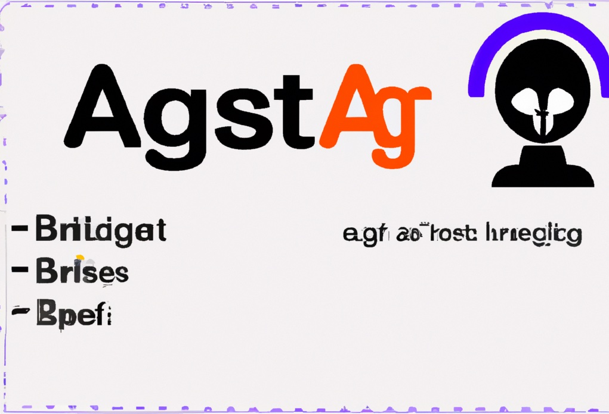

# AGIBootstrap
 AGIBootstrap is a self-bootstrapped artificial general intelligence (AGI) system designed for general coding tasks. The 'G' in AGI is often considered a humorous exaggeration due to the current limitations of AGI technology. **Note:** This README is a work in progress. Our priority is to complete the code vector searching functionality, which will subsequently be used to automate the generation of this README file.
## Usage
You can use AGIBootstrap by running the following command in your shell:

```shell
# go run ./cmd/agib --help
Usage:
  go run ./cmd/agib [command]

Available Commands:
  commit      Commits the current staged changes with an automatically generated commit message.
  completion  Generates the autocompletion script for the specified shell.
  generate    Creates a new file.
  help        Provides help about any command.
  init        Initializes a new project.

Flags:
  -h, --help   Displays help for app.

Use "app [command] --help" for more detailed information about a command.


```
## Origin
AGIBootstrap was conceived as a single ChatGPT 4 prompt, written in pure markdown, that brainstormed its design. The first few lines of almost working code were generated by ChatGPT 3.5-4k. This version of ChatGPT read each `.go` file, searched for `TODO:` comments, used `gpt-3.5-turbo` (4k) to complete them, and then wrote the result back to the file. The original author and the AI collaboratively set up the system to automatically generate commit messages, commit changes, and push these changes, creating an infinite loop.
## AI Safety
**Work in progress:** This section is largely derived from the stable-diffusion-2.1 model card, with minor adjustments. AGIBootstrap is intended for research purposes only. It may be used in various fields such as:
- Ensuring the safe deployment of models which could potentially generate harmful content.
- Probing and understanding the limitations and biases of generative models.
- Creating artworks and using them in design and other artistic processes.
- Developing educational or creative tools.
- Conducting research on generative models. Misuses, potential for malicious use, and out-of-scope uses are outlined below.
### Misuse, Malicious Use, and Out-of-Scope Use
AGIBootstrap should not be used to intentionally create or distribute code that fosters a hostile environment or unsupervised code devoid of checks and balances.
### Out-of-Scope Use
AGIBootstrap was not designed to create factual or accurate representations of people or events. Thus, using it to generate such content exceeds the model's capabilities and is considered out-of-scope.
### Misuse and Malicious Use
The misuse of AGIBootstrap includes, but is not limited to:
- Creating content that is demeaning, dehumanizing, or otherwise harmful to individuals or their environments, cultures, religions, etc.
- Deliberately promoting or spreading discriminatory content or harmful stereotypes.
- Impersonating individuals without their consent.
- Generating sexual content without the consent of the potential audience.
- Spreading misinformation or disinformation.
- Representing extreme violence or gore.
- Violating the terms of use of copyrighted or licensed material by sharing or modifying it.
## License
AGIBootstrap is licensed under the AGPL license. For more information, please refer to the [LICENSE.md](LICENSE.md) file.